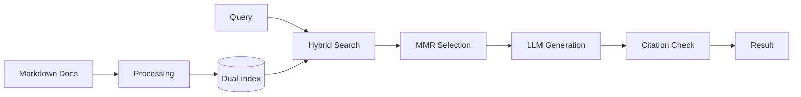

# Help Center RAG Assistant

This project is a retrieval-augmented generation (RAG) system for technical support documentation. It provides a searchable interface for markdown corpora using hybrid retrieval methods, aimed at generating answers that are strictly grounded in source material rather than general model knowledge.

## Key Features

- **Hybrid Retrieval Engine**: Combines keyword-based search (BM25) with semantic vector search (Dense Embeddings).
- **Reranking (MMR)**: Uses Maximal Marginal Relevance to diversify retrieved snippets and minimize redundant context.
- **Optional FAISS Support**: Includes hooks for FAISS-accelerated vector search for low-latency retrieval on larger datasets.
- **Strict Citation Policy**: Optional validation mode that enforces source grounding and rejects speculative answers.
- **Production Controls**: Features include circuit breakers, request caching, and rate limiting.
- **Dual Interface**: Full command-line tool (`ragctl`) and a FastAPI-based REST service.

## Architecture

The system processes queries through the following pipeline:

**Ingest** → **Chunk** → **Index** → **Retrieve** → **Rerank** → **Validate** → **Answer**



## Quickstart (Local)

### Prerequisites
- Python 3.11 or later
- [Ollama](https://ollama.com/) running with `nomic-embed-text` and `qwen2.5:32b`

### Installation
```bash
# Install package in editable mode
pip install -e ".[dev]"
```

### Ingestion
Place your knowledge base (e.g., `knowledge_base.md`) in the project root.
```bash
# Build indices
python -m clockify_rag.cli_modern ingest --input knowledge_base.md --force
```

## Usage Examples

### CLI (`ragctl`)
The `ragctl` entrypoint manages administrative and query tasks.

```bash
# Query the index
python -m clockify_rag.cli_modern query "How do I manage workspace permissions?"

# System health check
python -m clockify_rag.cli_modern doctor

# Interactive chat loop
python -m clockify_rag.cli_modern chat
```

### API
Start the FastAPI server:
```bash
uvicorn clockify_rag.api:app --host 0.0.0.0 --port 8000
```

Example request:
```bash
curl -X POST http://localhost:8000/v1/query \
  -H "Content-Type: application/json" \
  -d '{"question": "How do I reset my password?", "top_k": 5}'
```

## Configuration

Configuration is managed via environment variables or a `.env` file. Remote services defaults are set to `localhost`.

- `RAG_OLLAMA_URL`: Connection URL for the inference backend (Default: `http://localhost:11434`).
- `RAG_CHAT_MODEL`: The LLM used for response generation.
- `RAG_STRICT_CITATIONS`: Toggle (0/1) to enable mandatory citation validation.
- `ANN`: Set to `faiss` for accelerated ANN or `none` for brute-force search.

## Evaluation & Quality Gates

The project uses `ragas` and custom metrics to track retrieval performance.
```bash
# Run metrics suite
python eval.py
```
Standard internal quality gates require an MRR (Mean Reciprocal Rank) above `0.75` for the benchmark dataset.

## Safety / Citation Policy

Generated answers must include direct citations to the retrieved document chunks.
- **Citations**: Each answer block is paired with source metadata and a relevance score.
- **Strict Mode**: If enabled, the system will return a "No sources found" error rather than attempting a response if the retrieved context does not provide sufficient evidence.

## Repo Structure

- `clockify_rag/`: Core library (API, CLI, retrieval, and generation logic).
- `config/`: Configuration schemas and default parameter sets.
- `scripts/`: Development utilities and setup helpers.
- `tests/`: Unit and integration test suite.
- `eval.py`: Performance benchmarking script.

---
MIT License
