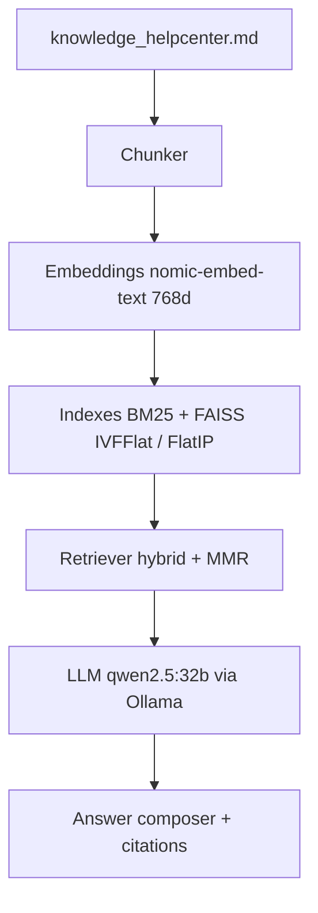

# Clockify RAG – Internal Support Assistant

RAG service that answers Clockify/CAKE support questions with citations. Defaults are zero-config for an internal corporate setup on Mac (VPN): Ollama at `http://10.127.0.192:11434`, chat model `qwen2.5:32b`, embeddings via Ollama `nomic-embed-text` (768-dim), corpus file `knowledge_helpcenter.md`.

## macOS M1 Pro – Clone > Steps > Instant Run
```bash
# 1) Clone and enter the repo
git clone https://github.com/apet97/ragtool.git
cd ragtool

# 2) Create and activate conda env (Python 3.12)
conda create -n clockify-rag python=3.12 -y
conda activate clockify-rag

# 3) Install FAISS (recommended on Apple Silicon)
conda install -c conda-forge faiss-cpu -y

# 4) Install project deps
pip install --upgrade pip
pip install -e ".[dev]"

# 5) Build the index (requires knowledge_helpcenter.md)
python -m clockify_rag.cli_modern ingest --input knowledge_helpcenter.md --force

# 6) Start interactive chat (talk to it like a support agent)
python -m clockify_rag.cli_modern chat
```
No environment variables required.

## Launch the CLI (best path, VPN, zero env vars)
```bash
# 1) Clone and enter the repo
git clone https://github.com/apet97/ragtool.git
cd ragtool

# 2) Create and activate conda env (Python 3.12)
conda create -n clockify-rag python=3.12 -y
conda activate clockify-rag

# 3) Install FAISS (recommended on Apple Silicon)
conda install -c conda-forge faiss-cpu -y

# 4) Install project deps
pip install --upgrade pip
pip install -e ".[dev]"

# 5) Build the index (requires knowledge_helpcenter.md)
python -m clockify_rag.cli_modern ingest --input knowledge_helpcenter.md --force

# 6) Start interactive chat (talk to it like a support agent)
python -m clockify_rag.cli_modern chat
```
If you skip FAISS, it still works (BM25 + flat dense), just slower on large corpora. Defaults already point to the internal Ollama host/model—no env vars needed.

## Run the API (localhost)
```bash
uvicorn clockify_rag.api:app --host 0.0.0.0 --port 8000
curl -X POST http://127.0.0.1:8000/v1/query \
  -H "Content-Type: application/json" \
  -d '{"question": "How do I add time for others?", "top_k": 8}'
```

## Architecture at a glance

```mermaid
flowchart TD
    A[knowledge_helpcenter.md] --> B[Chunker]
    B --> C[Embeddings nomic-embed-text 768d]
    C --> D[Indexes BM25 + FAISS IVFFlat / FlatIP]
    D --> E[Retriever hybrid + MMR]
    E --> F[LLM qwen2.5:32b via Ollama]
    F --> G[Answer composer + citations]
```

**What this means (plain English)**
- Start with the help docs in `knowledge_helpcenter.md`.
- Split docs into small sections so they’re easy to search.
- Turn each section into numeric “fingerprints” (embeddings) and also keep a keyword index.
- When you ask a question, search both indexes, blend the best matches, and pick the top snippets.
- Send those snippets to the AI (Qwen 2.5 on our Ollama server) to draft the answer.
- Return the answer with citations showing exactly which snippets were used.

## Commands you’ll use
- Build index: `python -m clockify_rag.cli_modern ingest --input knowledge_helpcenter.md --force`
- CLI query: `python -m clockify_rag.cli_modern query "How do I add time for others?"`
- Chat REPL: `python -m clockify_rag.cli_modern chat`
- Doctor: `python -m clockify_rag.cli_modern doctor --json`
- API: `uvicorn clockify_rag.api:app --host 0.0.0.0 --port 8000`

Use `clockify_rag.cli_modern` for all CLI usage.

## Defaults (zero env required on VPN)
- `RAG_OLLAMA_URL`: `http://10.127.0.192:11434` (override for local with `http://127.0.0.1:11434`)
- `RAG_CHAT_MODEL`: `qwen2.5:32b`
- `RAG_EMBED_MODEL`: `nomic-embed-text` (768-dim)
- `EMB_BACKEND`: `ollama` (set `local` for offline dev; conftest pins local for tests)
- Corpus resolution: `knowledge_helpcenter.md` only
- Timeouts/retries: connect 3s, read 120s, retries 2 (VPN-friendly)
- Env vars and `.env` still override; `validate_and_set_config()` refreshes derived dims/models.

## Knowledge base & artifacts
- Ingest reads `knowledge_helpcenter.md`; resolves via `resolve_corpus_path`.
- Artifacts live beside the corpus unless `--output` is set: `chunks.jsonl`, `vecs_n.npy`, `bm25.json`, `faiss.index` (when FAISS present), `index.meta.json`.

## Testing
- Full suite: `pytest` (tests pin local embeddings; Ollama not required). Last run: all passed on Python 3.12; FAISS tests skipped unless installed.
- Smoke on VPN: `python -m clockify_rag.cli_modern ingest --force` then `python -m clockify_rag.cli_modern query "Lock timesheets"`.

## Troubleshooting
- Ollama unreachable: check VPN and `curl http://10.127.0.192:11434/api/tags`; override to `http://127.0.0.1:11434` if running local.
- FAISS missing on macOS arm64: install via conda (`conda install -c conda-forge faiss-cpu`); otherwise auto-falls back to flat search.
- Corpus missing: ensure `knowledge_helpcenter.md` is present (or pass `--input`).
